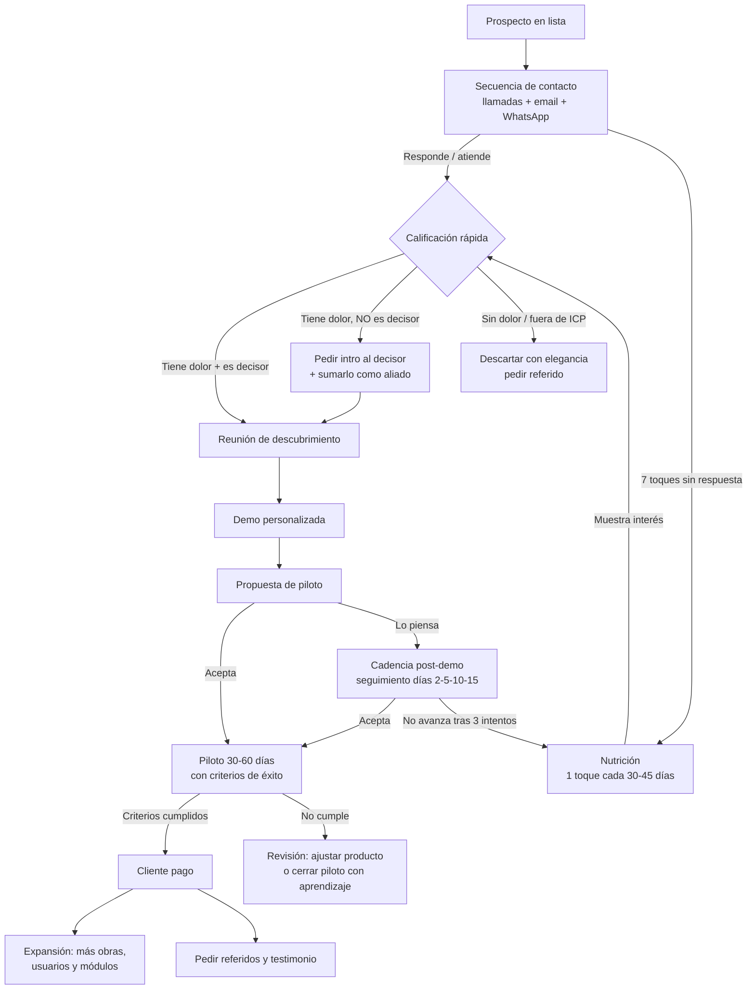
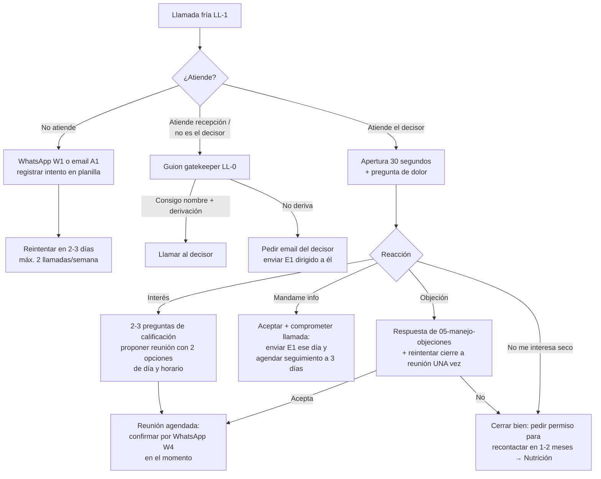
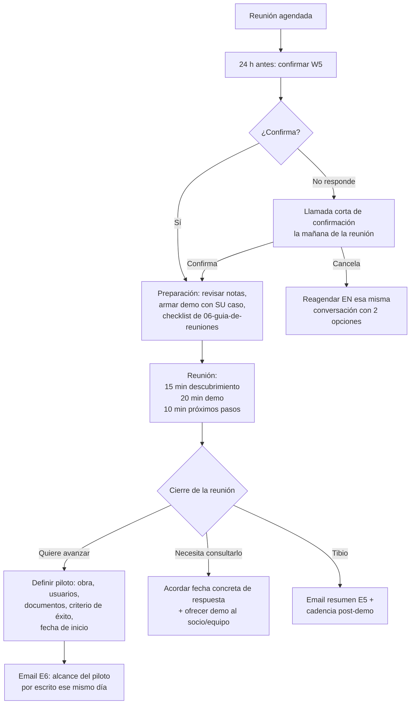
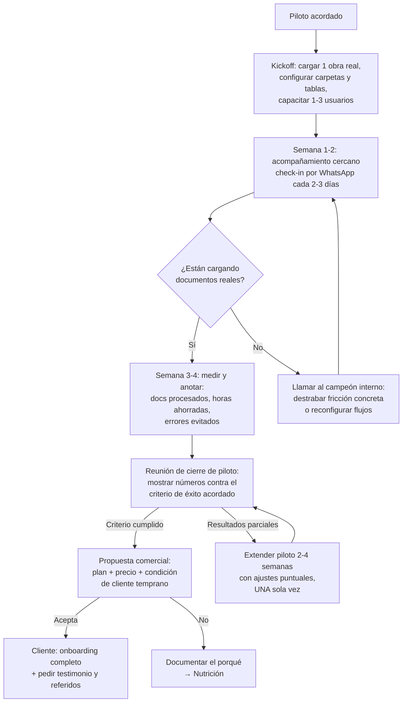

# 02 — Diagramas de Acción

Diagramas de flujo para decidir el próximo paso según lo que pasó. Los códigos entre paréntesis (`E1`, `W2`, `LL-1`, etc.) refieren a las plantillas de `04-mensajes-prearmados.md` y los guiones de `03-guiones-de-llamadas.md`.

---

## 1. Pipeline completo



---

## 2. Primer contacto telefónico



---

## 3. Día de la reunión / demo



---

## 4. Árbol de decisión: respuestas a mensajes (email/WhatsApp)

```mermaid
flowchart TD
    A[Llega respuesta] --> B{Tipo de respuesta}
    B -->|"Contame más / me interesa"| C[NO explicar todo por escrito:<br/>responder con R1 y proponer<br/>llamada de 15 min con 2 horarios]
    B -->|"¿Cuánto cuesta?"| D[Respuesta R2: rango honesto +<br/>"depende de obras y usuarios" +<br/>llevar a reunión]
    B -->|"Mandame info"| E[Enviar E4 una página +<br/>anunciar llamada en 3 días]
    B -->|"Ahora no / estamos a full"| F[R4: empatizar + preguntar<br/>cuándo retomar + agendar<br/>recontacto en planilla]
    B -->|"Ya tenemos un sistema /<br/>nos arreglamos con Excel"| G[R5: no pelear contra el Excel,<br/>preguntar por el hueco:<br/>papeles, fotos, WhatsApp]
    B -->|Deriva a otra persona| H[Agradecer + pedir presentación<br/>directa por el mismo canal +<br/>contactar al derivado en 24 h]
    B -->|Negativa clara| I[R8: agradecer, dejar puerta<br/>abierta, pedir referido,<br/>mover a Nutrición]
    C --> Z[Registrar en planilla:<br/>etapa + próximo paso + fecha]
    D --> Z
    E --> Z
    F --> Z
    G --> Z
    H --> Z
    I --> Z
```

---

## 5. Flujo del piloto (de piloto a cliente)



---

## 6. Reglas transversales (aplican a todos los flujos)

1. **Todo termina en la planilla**: después de cada toque, actualizar etapa, próximo paso y fecha. Sin excepción.
2. **Nunca dos seguimientos idénticos seguidos**: cada toque cambia de ángulo (problema → caso GEC → licitaciones → cierre).
3. **El silencio no es un "no"**: recién después del toque de cierre (T7) el prospecto pasa a Nutrición.
4. **Un "no" hoy es un prospecto para dentro de 3 meses**: cerrar siempre en buenos términos y pedir referido.
5. **Velocidad de respuesta**: responder mensajes entrantes el mismo día hábil; un prospecto que escribe está caliente por horas, no por semanas.
